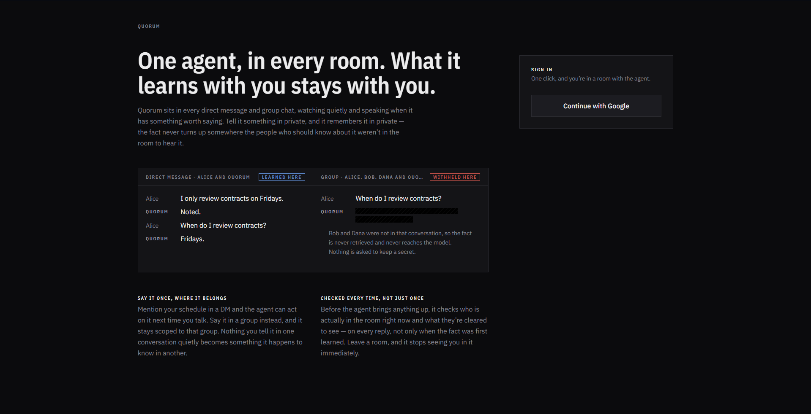
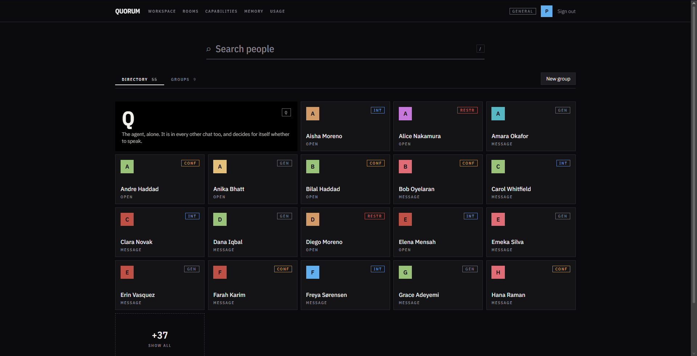
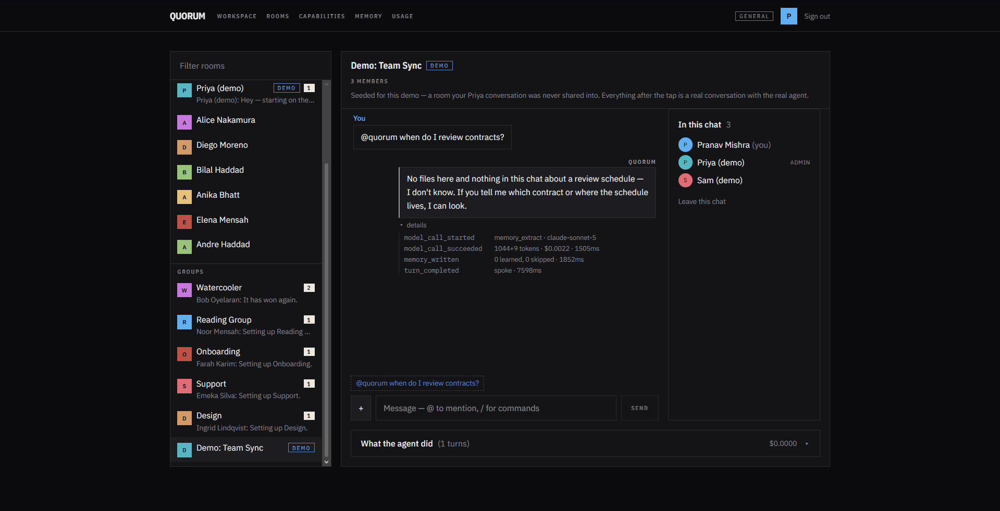

# Quorum

A shared chat workspace — DMs and group rooms — with one AI teammate present
everywhere. It decides for itself when a room needs it to speak, and it
remembers things about the people it works with **without ever using what it
learned in one room to answer in another where it doesn't belong.**

TypeScript end to end: Next.js on Vercel, Postgres on Supabase, Claude for the
agent.



> **Live at <https://quorum-rho.vercel.app>.** Sign in with Google, or click
> straight into one of two standing showcase accounts on the landing page —
> "Jordan Reyes" and "Morgan Blake" — each with several rooms, one gated by
> clearance, and memory already built up, no setup required.
>
> **Status: built and deployed.** Auth, chats, the response gate, the turn
> pipeline, memory retrieval and extraction, connectors, admin mode, and the
> agent internal view are all implemented, with **628 assertions passing**
> against a real PostgreSQL. Verify the claims yourself with
> [`docs/VERIFY.md`](docs/VERIFY.md) — every check states what to do, what to
> expect, and what failure looks like.

---

## Why it's built this way

I read this less as "add an AI chatbot to a messaging app" and more as: what
does it take to put an AI teammate inside a real workplace's chat, permanently,
across every DM and every channel? That framing is what drove almost every
decision here.

A workplace is exactly the setting where an AI that remembers things becomes
dangerous by default. People tell a colleague something in a DM they would
never say in the all-hands channel — a deadline they're behind on, a concern
about a deal, a scheduling preference. An assistant that's present everywhere
and "learns useful things about users for later" will, on the most obvious
implementation, repeat the DM fact in the all-hands room the moment it seems
relevant. Nobody asked for that; a naive `user_id → memories[]` store just
produces it, quietly, and the demo still looks like it works right up until
it doesn't.

So I made that the actual center of the build: **memory here is an
authorisation problem, not a retrieval problem.** A fact is checked against
who was in the room when it was learned and what that room is cleared to see,
in SQL, before the model ever sees it — not ranked and hoped-for. Everything
else (which tools the agent has, how polished the UI is) was deliberately
secondary to getting that one rule right and provably enforced, because it's
the part that actually matters if this were a real product.

The write-ups of *how* — the exact rule, the two authorisation axes, every
tradeoff and the argument against it — live in
[`docs/DECISIONS.md`](docs/DECISIONS.md) and
[`docs/ARCHITECTURE.md`](docs/ARCHITECTURE.md) rather than repeated here; this
file stays a working overview.

## The rule memory follows

> A fact learned in chat **C1** may surface in chat **C2** only if every active
> member of C2 was present when it was learned, **and** C2 is cleared for it.
> Both conditions, evaluated in SQL, before anything is ranked.

Two things worth knowing about it:

- **It fails closed on purpose in the one case that would otherwise fail
  open.** "Every member of C2 was in the audience" is vacuously true for a
  room with zero members — so an emptied-out chat has to explicitly return
  nothing, or it would match everything. There's a test for exactly this.
- **The model never receives out-of-scope memory at all.** It isn't asked to
  keep a secret; it's never handed the secret. Structural, not a prompt.

Retrieval itself is filter, then rank, then cap — in that order, always,
because ranking the top 20 by relevance and discarding the unauthorised ones
afterward is a different program with the same output most of the time, and a
leak the rest of the time. Full detail, including what this doesn't solve
(no semantic ranking, no defence against a human combining two separately-fine
answers): [`docs/MEMORY.md`](docs/MEMORY.md).

## Authorisation: two independent axes

**Membership** (are you in this chat?) and **clearance** (are you cleared for
this kind of chat?) are checked separately, both in SQL, on every read. A
chat gated at *Confidential* is unreachable without that clearance level
regardless of any membership row — which is exactly what makes the clearance
half of the memory rule meaningful rather than redundant.

Row-level security is on for every table, in the migration that creates it —
the browser holds a publishable key, and RLS is the only reason that's safe.
Memory tables go further: no client policy at all, reachable only through a
server-side scoped path (`ScopedAgentContext`) that re-checks both axes on
every privileged read rather than caching them across a model call — caching
them is the time-of-check/time-of-use gap this design exists to avoid. Full
argument, including the four-layer "a class is not a security boundary"
breakdown: [`docs/ARCHITECTURE.md`](docs/ARCHITECTURE.md).

## When the agent speaks

Present in every room, silent by default. A deterministic chain handles the
obvious cases first (never reply to itself; always reply in a 1:1 with it;
reply when mentioned or replied to; stay quiet in an unaddressed DM or within
its own cooldown) and only falls through to a model judge for genuine
ambiguity — one biased toward silence, because an assistant that occasionally
misses a moment is far less annoying than one that never shuts up. Every
decision, including every silent one, is logged.

That log is the **agent internal view** — per chat, per turn: which rule
fired, how many memory items were retrieved and how many were filtered out,
every tool call, every token spent. It's the most prominent feature after the
chat itself, because a memory-isolation rule you can't see working is
indistinguishable from one that isn't.

## Tools and untrusted content

File and web tools put text the agent didn't write into its context — a
document, a search result, an email. That text is treated as data, wrapped
with explicit provenance, never as instructions. The actual boundary against
prompt injection isn't the wrapping (delimiter-style defences are beaten by
adaptive attacks the overwhelming majority of the time in the literature) —
it's that **once a turn has read untrusted content, it can't make another
externally-observable call for the rest of that turn**, enforced in code, not
asked of the model.

One consequence specific to a system that remembers, worth calling out because
general injection write-ups don't cover it: extraction runs on the model's own
reply, so a document that tricks the model into asserting something false
about a user would otherwise plant that lie into memory, correctly authorised,
forever. Anything extracted from a turn that touched untrusted content is
therefore capped below the confidence threshold — it never gets retrieved,
though it stays visible in the internal view.

---

## Getting started

Requires Node 22+, pnpm 9+, a Supabase project, and an Anthropic API key.

```bash
pnpm install
cp .env.example .env.local   # then fill it in — see below
pnpm dev
```

Filling in `.env.local`:

- **Supabase** — [`docs/SETUP-SUPABASE.md`](docs/SETUP-SUPABASE.md) (~25 min,
  mostly Google's OAuth consent screen)
- **Vercel** — [`docs/SETUP-VERCEL.md`](docs/SETUP-VERCEL.md), only needed to
  deploy your own copy

**Talking to more than one person without setting up Google OAuth first:** set
`ALLOW_DEV_LOGIN=true` and run `pnpm seed:dev` — the landing page then offers
five seeded accounts with different clearances and overlapping chats. Or run
`pnpm seed:showcase` for the two richer standing accounts described above.
Both routes are closed by default; see either script's header for exactly how.

Model choice, thinking depth, cost tiers, gate thresholds, memory caps and
rate limits all live in [`config/`](config/), not scattered through the code.

**Verifying it, not just running it:**

```bash
pnpm check    # boundaries + lint + test — the same gate CI runs
pnpm test     # 628 assertions, including the full authorisation/memory suite
```

`pnpm test` provisions its own real PostgreSQL automatically (via
`embedded-postgres` — no Docker, nothing to configure) because an in-JS
Postgres emulator wouldn't implement row-level security, and RLS is the thing
under test.

---

## What it looks like

**Workspace** — the People/Groups directory:



**Rooms** — a room open, roster visible, agent internal view expanded:



---

## Tests that matter

Not coverage — each one defends a specific claim above. Full list, by file:
[`tests/README.md`](tests/README.md). Want to see the actual agent decide
something on data you made up, rather than read a rule proven against the
database? `pnpm scenario scenarios/memory-isolation.json` drives the real
pipeline — real gate, real memory retrieval, real Claude call — against a
scenario file you can edit; see [`tests/README.md`](tests/README.md#scenarios--driving-the-real-pipeline-with-your-own-data).

The ones that matter most:

- **Memory isolation.** An item learned in a DM never surfaces in a group
  containing anyone outside it. An item learned at a higher clearance never
  surfaces in a lower-clearance room, even with an *identical* member list —
  proving the clearance axis isn't redundant with membership. A
  `ScopedAgentContext` built for one chat returns nothing from another.
- **Authorisation.** A non-member reads nothing — no messages, no roster, no
  files. A removed member's next read returns nothing; a removal landing
  mid-turn takes effect on the agent's *next* privileged read (tested
  separately, because one test alone can't distinguish "revoked" from "a
  cache that's merely cold").
- **Agent behaviour**, against a stubbed provider so the suite needs no API
  key: never replies to itself, always replies when mentioned, the judge only
  runs when the deterministic chain falls through, and a judge error or
  timeout resolves to silence rather than a guess.
- **Memory lifecycle.** A stated fact supersedes a conflicting inferred one; a
  superseded or below-threshold item is never retrieved.

## Decisions, assumptions, and what I'd do next

Where the requirements were genuinely open, I picked a reading and said so
rather than guessing silently — the full list, with the reasoning and the
counter-argument for each, is in
[`docs/DECISIONS.md`](docs/DECISIONS.md). The ones that shape the product
most: a solo `agent` chat type exists so the assistant can be addressed
directly; a removed member loses access on their *next* read rather than
retroactively (Realtime can't be revoked mid-socket, only closed on their
next request); memory audience is a snapshot at learn time, never
re-evaluated against current membership; clearance is one sensitivity
dimension, not a full entitlement lattice.

**Cut, deliberately, and why:** no knowledge graph — tested against the bar
"name three product queries a graph answers better than a flat table," and it
cleared one and a half, not three (full argument in
[D-007](docs/DECISIONS.md)); no semantic/embedding ranking, since Anthropic
ships no embeddings API and the authorisation filter already narrows the
candidate set to tens of items before ranking matters ([D-004](docs/DECISIONS.md));
no force-directed space view — the least-graded, most decorative piece,
scheduled last and never reached.

**What shipped beyond the original plan:** read-only Gmail/Calendar
connectors, a self-service admin mode for demonstrating both authorisation
axes from one browser, a subject-access memory page (what the agent knows
about *you*, specifically — a different question from what it may repeat in
a given room), a seeded demo world so the withholding claim is something you
can watch happen, and the two showcase accounts above.

**With more time:** semantic ranking (an embeddings provider is a one-file
swap away, `lib/memory/embed.ts`), the space view, and closing the last gap in
D-009 — an in-flight turn can't be retroactively corrected if authorisation
changes mid-call, only the *next* one is guaranteed correct.

---

## AI tooling

How AI tools were used, what was generated versus hand-written, and how the
output was checked, as a running log rather than reconstructed after the
fact: [`docs/AI-USAGE.md`](docs/AI-USAGE.md).
